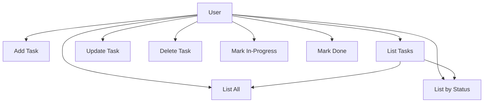
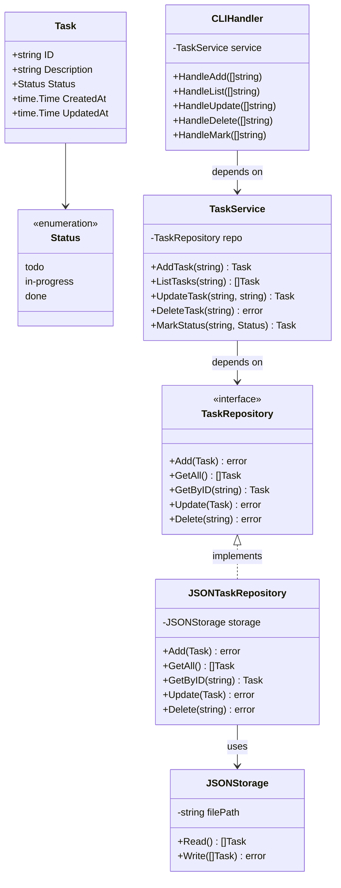
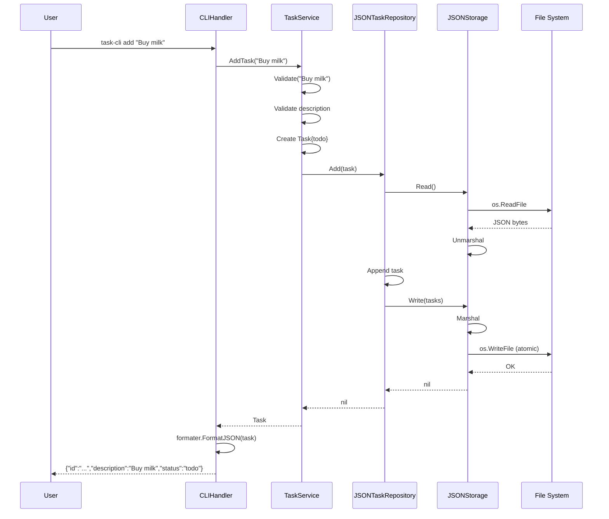
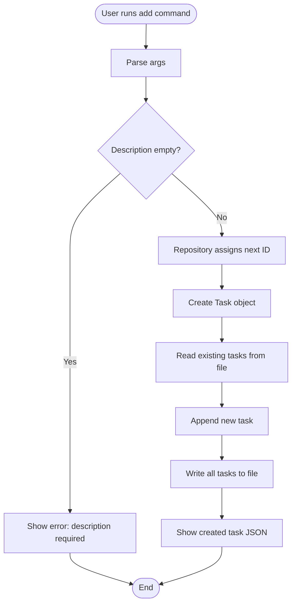
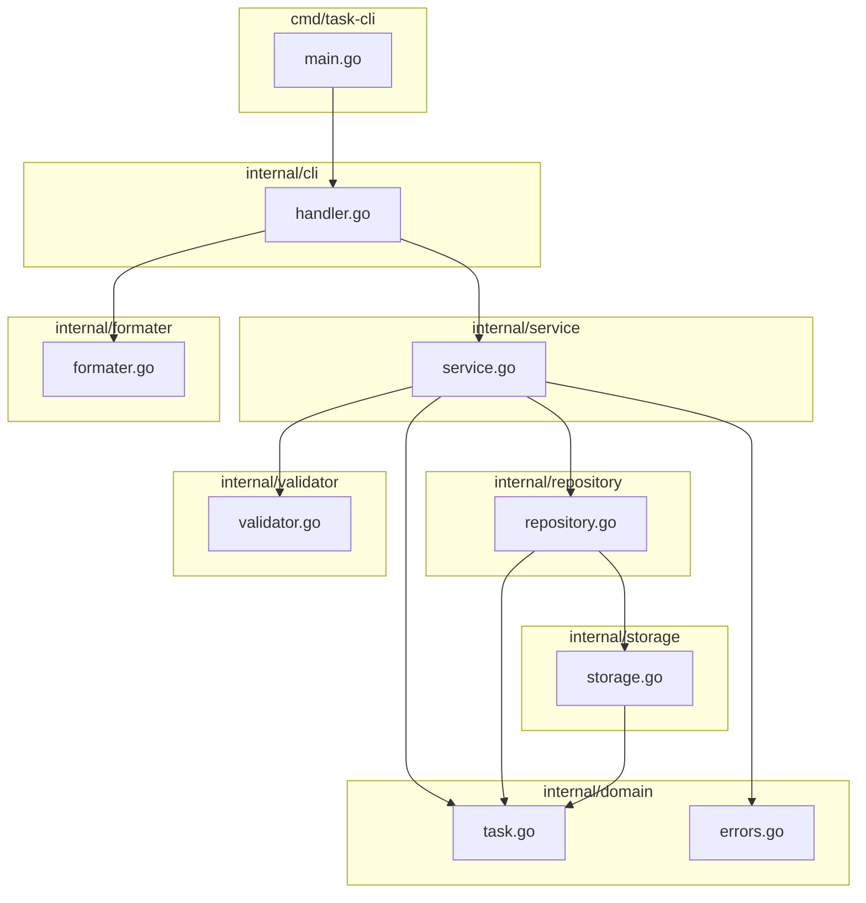
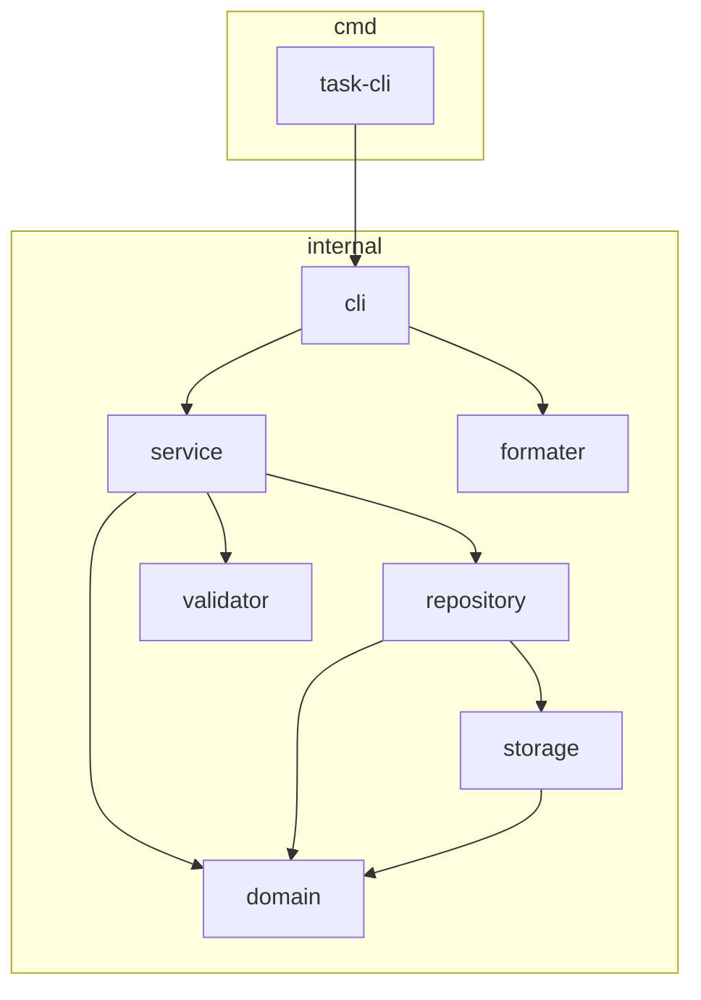
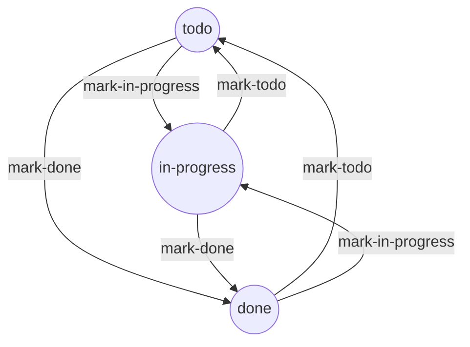
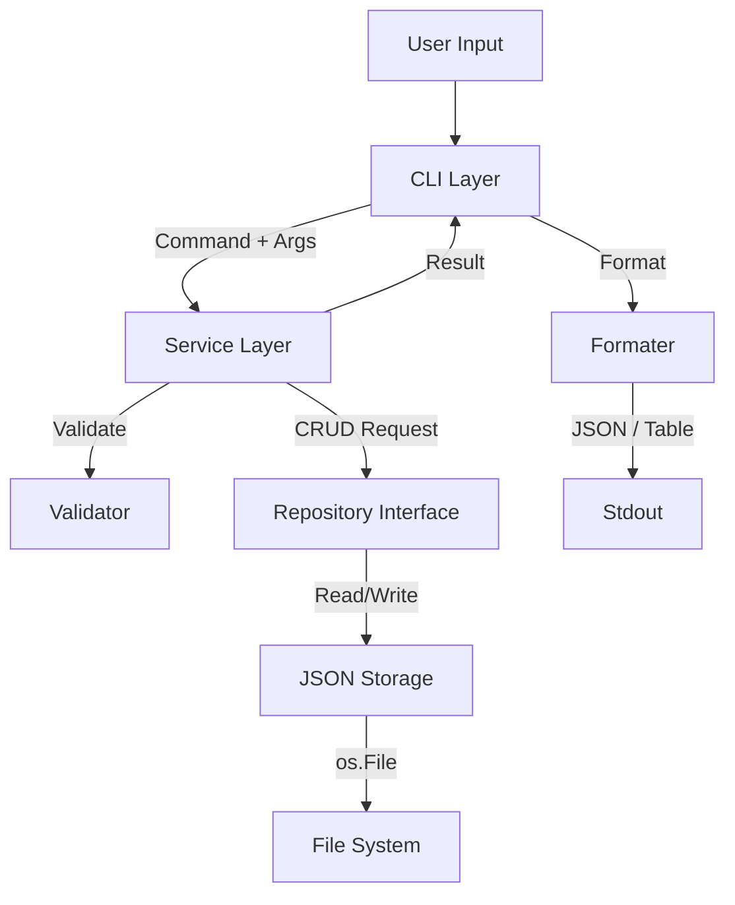
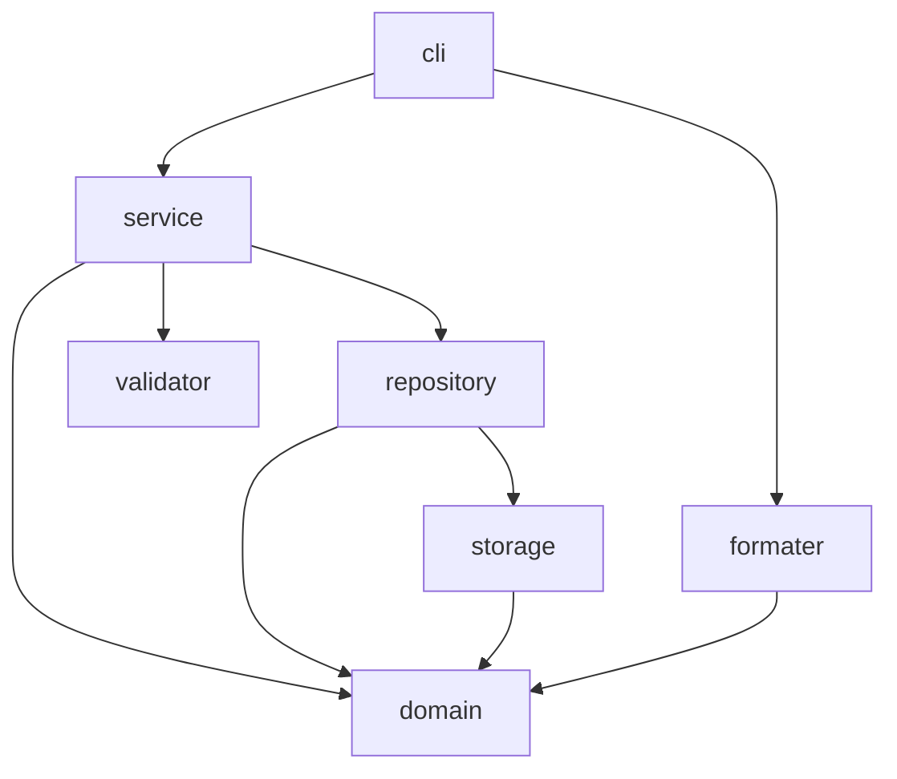

# Software Design Document — Task Tracker CLI

| **Document** | Software Design Document |
|---|---|
| **Version** | 1.0 |
| **Status** | Draft |
| **Author** | Software Architect |
| **Language** | Go (1.26) |
| **Storage** | JSON File |
| **Dependencies** | None (Standard Library only) |

---

## Table of Contents

1. [Executive Summary](#1-executive-summary)
2. [Requirements Analysis](#2-requirements-analysis)
3. [Architecture Decision Records (ADR)](#3-architecture-decision-records-adr)
4. [System Architecture](#4-system-architecture)
5. [Domain Analysis](#5-domain-analysis)
6. [UML Diagrams](#6-uml-diagrams)
7. [Package Design](#7-package-design)
8. [Data Storage Design](#8-data-storage-design)
9. [Error Handling Strategy](#9-error-handling-strategy)
10. [Security Considerations](#10-security-considerations)
11. [Design Principles](#11-design-principles)
12. [Design Patterns](#12-design-patterns)
13. [Testing Strategy](#13-testing-strategy)
14. [Git Workflow](#14-git-workflow)
15. [Coding Standards](#15-coding-standards)
16. [Future Roadmap](#16-future-roadmap)
17. [Lessons Learned](#17-lessons-learned)

---

## 1 Executive Summary

### 1.1 Project Overview

**Task Tracker CLI** is a command-line task management tool written in Go. Users can create, read, update, delete, and track the status of tasks directly from their terminal. Tasks are persisted to a local JSON file. The project uses zero external dependencies — only the Go standard library.

### 1.2 Problem Statement

Most task-tracking tools are either overly complex (Jira, Notion), require a GUI (Todoist), or come with heavy infrastructure dependencies (databases, web servers). Developers and power users need a lightweight, scriptable, offline tool that lives in the terminal. **Task Tracker CLI** fills this niche: a zero-dependency, single-binary CLI that a developer can install in seconds and use immediately.

### 1.3 Goals

- Provide a usable CLI for day-to-day personal task tracking.
- Demonstrate Clean Architecture and SOLID principles in a small Go project.
- Use 100% Go standard library — no third-party dependencies.
- Keep the codebase simple enough for a single developer to understand in one sitting yet structured enough to scale.
- Serve as a strong portfolio piece for backend engineering roles.

### 1.4 Scope

**In Scope:**
- CRUD operations on tasks (Add, List, Update, Delete).
- Status management (`todo` → `in-progress` → `done`).
- Persistence to a local JSON file.
- JSON and human-readable table output.
- Input validation and error handling.
- Unit and integration tests.

**Out of Scope:**
- Multi-user support.
- Remote synchronization.
- Database backends.
- Web or terminal UI beyond the CLI.
- Authentication / authorization.
- Recurring tasks, priorities, deadlines, tags (see [Future Roadmap](#16-future-roadmap)).

### 1.5 Key Metrics

| Metric | Target |
|---|---|
| Build time | < 2 seconds |
| Binary size | < 10 MB |
| Time to add a task | < 50 ms |
| Lines of code | < 2000 (excluding tests) |
| Test coverage | > 80% |
| External dependencies | 0 |

---

## 2 Requirements Analysis

### 2.1 Functional Requirements

| ID | Requirement | Priority |
|---|---|---|
| FR-01 | User can add a task with a description string | Must |
| FR-02 | User can list all tasks | Must |
| FR-03 | User can list tasks filtered by status | Must |
| FR-04 | User can update a task's description by ID | Must |
| FR-05 | User can delete a task by ID | Must |
| FR-06 | User can mark a task as `in-progress` | Must |
| FR-07 | User can mark a task as `done` | Must |
| FR-08 | System assigns a unique ID to each task | Must |
| FR-09 | System records created-at and updated-at timestamps | Must |
| FR-10 | User can view output as JSON (default) | Should |
| FR-11 | User can view output as a formatted table (--table flag) | Should |
| FR-12 | User sees helpful error messages for invalid input | Should |

### 2.2 Non-Functional Requirements

| ID | Requirement | Category |
|---|---|---|
| NFR-01 | No external dependencies beyond Go standard library | Maintainability |
| NFR-02 | Binary must work on Linux, macOS, Windows | Portability |
| NFR-03 | Compilation must succeed with `go build` only | Buildability |
| NFR-04 | No data loss on single write failure (atomic writes) | Reliability |
| NFR-05 | All user-facing errors are human-readable | Usability |
| NFR-06 | Code must pass `go vet` and `gofmt` without warnings | Quality |
| NFR-07 | Test coverage must exceed 80% | Quality |

### 2.3 Constraints

| Constraint | Rationale |
|---|---|
| Must use Go 1.21+ | Uses standard library features for file I/O, JSON, and CLI |
| No external modules | Keep the build simple and dependency-free |
| Storage is a single JSON file | Simplest possible persistence that survives reboots |
| Must run without network access | Offline-first |

### 2.4 Assumptions

- The user has a single machine; no concurrent access from multiple processes.
- The local file system is writable in the data directory.
- File size stays under ~10 MB (reasonable for personal task tracking).
- The user runs one instance at a time (no process-level locking needed).

### 2.5 Business Rules

| Rule | Description |
|---|---|
| BR-01 | A task description cannot be empty. |
| BR-02 | A task description cannot exceed 500 characters. |
| BR-03 | A task's ID is immutable after creation. |
| BR-04 | A task can transition from `todo` → `in-progress` → `done`. |
| BR-05 | A task can transition from `done` back to `todo`. |
| BR-06 | A task can transition from `done` back to `in-progress`. |
| BR-07 | Deleted tasks cannot be recovered. |
| BR-08 | Each task must have a unique ID. |

### 2.6 Acceptance Criteria

```gherkin
Scenario: Add a valid task
  Given the CLI is installed
  When I run "task-cli add 'Buy groceries'"
  Then the output contains the new task with status "todo"

Scenario: List tasks filtered by "done"
  Given I have tasks with various statuses
  When I run "task-cli list done"
  Then only tasks with status "done" are displayed

Scenario: Attempt to add a task with an empty description
  When I run "task-cli add ''"
  Then the output shows an error "description cannot be empty"
  And the exit code is non-zero

Scenario: Invalid status transition
  Given a task with status "done"
  When I run "task-cli mark-in-progress <id>"
  Then the task transitions to "in-progress" successfully (re-open is allowed)
```

*Note: All status transitions are permitted in any order — no invalid transition error is raised. This is intentional for a simple task tracker (see Section 5).*

---

## 3 Architecture Decision Records (ADR)

### ADR-001: Why Go

| Field | Value |
|---|---|
| **Problem** | Choose a programming language for this project. |
| **Alternatives** | Rust, Python, Node.js, C |
| **Decision** | Go |
| **Trade-offs** | Go compiles to a single static binary with no runtime dependency. |
| **Consequences** | Faster startup than Python/Node. Slightly more verbose than Python but faster. |

**Rationale:** Go produces a small, statically-linked binary that runs everywhere. It has a built-in testing tool, formatting standard (`gofmt`), and concurrency primitives if needed later. Its standard library includes everything we need: file I/O, JSON encoding, CLI flags, and text formatting. This makes it the ideal language for a zero-dependency CLI tool.

---

### ADR-002: Why CLI, Not GUI / TUI / Web

| Field | Value |
|---|---|
| **Problem** | Choose the interaction paradigm. |
| **Alternatives** | Web UI, Terminal UI (TUI), Desktop GUI, REST API + separate client |
| **Decision** | CLI |
| **Trade-offs** | Steepest learning curve for non-technical users. Easiest to script and integrate into shell pipelines. |
| **Consequences** | Natural fit for developers. Can later add a REST API or TUI as an alternative interface to the same service layer. |

**Rationale:** The primary audience is developers and power users. A CLI is the simplest interface to implement, test, and script. It follows the Unix philosophy of doing one thing well and composing with other tools via pipes.

---

### ADR-003: Why JSON File Storage (Not a Database)

| Field | Value |
|---|---|
| **Problem** | Choose the persistence mechanism. |
| **Alternatives** | PostgreSQL, SQLite, BoltDB, CSV, YAML |
| **Decision** | JSON file |
| **Trade-offs** | No query capabilities, no concurrent access, no indexing. Simple to inspect and edit manually. |
| **Consequences** | No database setup, no daemon process. Entire data store is a single human-readable file. |

**Rationale:** For a single-user CLI with hundreds (not millions) of tasks, a JSON file is sufficient. It avoids the complexity of embedding SQLite (CGo) or running a database server. JSON's structure maps naturally to Go's `struct`. The trade-off is worth the simplicity gain.

---

### ADR-004: Why No External Dependencies

| Field | Value |
|---|---|
| **Problem** | Decide whether to use third-party modules. |
| **Alternatives** | Use cobra + pflag for CLI, use google/uuid for IDs, use alexflint/go-arg for flags |
| **Decision** | Zero external dependencies |
| **Trade-offs** | More manual code for CLI parsing. No dependency-vuln surface. Build is always reproducible. |
| **Consequences** | `go build` works immediately with no `go mod download` step. Binary is self-contained. |

**Rationale:** The Go standard library provides everything needed: `flag` for CLI parsing, `encoding/json` for serialization, `text/tabwriter` for table formatting, and `os` for file I/O. Adding external libraries would add risk (supply chain), bloat, and maintenance burden with no meaningful benefit for this scope.

---

### ADR-005: Why Layered Architecture (Not Hexagonal / Clean Architecture in its full form)

| Field | Value |
|---|---|
| **Problem** | Choose the architectural pattern. |
| **Alternatives** | Full Hexagonal (Ports & Adapters), MVC, Flat structure |
| **Decision** | Layered Architecture with dependency inversion |
| **Trade-offs** | More files than a flat structure. Clear separation of concerns. |
| **Consequences** | Each layer has a single responsibility. Changes in one layer do not ripple to others. |

**Rationale:** A full Hexagonal architecture adds ports/adapter boilerplate that is not justified for a project of this size. Layered Architecture achieves the same separation with less ceremony. We still apply Dependency Inversion (the service depends on the repository interface, not the implementation).

---

### ADR-006: Why Repository Pattern

| Field | Value |
|---|---|
| **Problem** | Decide how to abstract data access. |
| **Alternatives** | Direct file I/O in the service layer, global functions |
| **Decision** | Repository Pattern |
| **Trade-offs** | Adds one layer of indirection. Enables swapping storage implementations. |
| **Consequences** | Service layer is storage-agnostic. Can later add a SQLite repository without changing business logic. |

**Rationale:** The Repository Pattern decouples business logic from data access. It makes the service layer testable (inject a mock repository) and allows clean migration to other storage backends in the future.

---

### ADR-007: Why `internal/` Package

| Field | Value |
|---|---|
| **Problem** | Decide how to prevent external packages from importing our internals. |
| **Alternatives** | Use lowercase packages only, no enforcement |
| **Decision** | Use Go's `internal/` package mechanism |
| **Trade-offs** | Enforced by compiler. Cannot be imported from outside the module. |
| **Consequences** | Clear public/private boundary. External consumers can only import `pkg/`. |

**Rationale:** The Go compiler enforces that `internal/` packages can only be imported by the module's own code. This prevents accidental coupling from external consumers and communicates intent: "this is not a public library."

---

### ADR-008: Why `cmd/` Directory

| Field | Value |
|---|---|
| **Problem** | Decide directory layout for main packages. |
| **Alternatives** | Single `main.go` at root, `app/` directory |
| **Decision** | `cmd/<name>/main.go` pattern |
| **Trade-offs** | One extra directory level. Follows Go community convention. |
| **Consequences** | Compatible with `go install`. Can add multiple binaries later (`cmd/server/`, `cmd/migrate/`). |

**Rationale:** This is the community-standard layout recommended in the Go project itself. It allows multiple binaries in one repository and works correctly with `go install`, `go build`, and `go run`.

---

### ADR-009: Why Auto-increment Integer IDs (Not UUID)

| Field | Value |
|---|---|
| **Problem** | Choose the task ID generation strategy. |
| **Alternatives** | UUIDv4, UUIDv7, nano-timestamp, random string |
| **Decision** | Auto-increment integer |
| **Trade-offs** | Sequential, easy to type. Requires coordination (max+1) on every write. |
| **Consequences** | IDs start at 1 and increment. Users can type IDs directly in CLI commands. |

**Rationale:** Auto-increment integer IDs are the simplest for a CLI tool. Users type `task-cli update 1 "new desc"` instead of `task-cli update 018c4f3a-...`. The repository computes `max(ID) + 1` on every add. For a single-user CLI with < 10,000 tasks, performance is negligible. The ID is an implementation detail of the repository layer — other layers never generate IDs.

---

### ADR-010: Why `flag` Package Over Manual Parsing

| Field | Value |
|---|---|
| **Problem** | Choose the CLI argument parsing strategy. |
| **Alternatives** | `os.Args` switch, `cobra`, `pflag` |
| **Decision** | Go's `flag` package |
| **Trade-offs** | No subcommand support natively. Must implement subcommand dispatch manually. |
| **Consequences** | No external dependency. Some manual plumbing for subcommand routing. |

**Rationale:** The `flag` package is in the standard library and handles `-h`, `--help`, type parsing, and error messages. Subcommand dispatch is trivial: read `os.Args[1]` as the command and route accordingly. This avoids pulling in a heavy CLI framework for a tool with ~7 commands.

---

### ADR-011: Why JSON as Default Output (Not Table)

| Field | Value |
|---|---|
| **Problem** | Choose the default output format. |
| **Alternatives** | Table default, plain text default |
| **Decision** | JSON default, `--table` flag for human-readable |
| **Trade-offs** | JSON is less human-friendly but machine-parseable. |
| **Consequences** | Pipes naturally with `jq`. Developers can integrate the output into scripts. |

**Rationale:** JSON is the lingua franca of data interchange. By defaulting to JSON, the CLI composes naturally with shell tools (`jq`, `grep`, etc.). The `--table` flag provides human-readable output when interactively reading tasks.

---

### ADR-012: Why Not Strategy / Factory Patterns

| Field | Value |
|---|---|
| **Problem** | Some design patterns add complexity without benefit. |
| **Alternatives** | Apply every Gang of Four pattern |
| **Decision** | Only use patterns justified by actual (not imagined) needs |
| **Trade-offs** | Less "pattern vocabulary" in the codebase. Smaller, simpler code. |
| **Consequences** | No unnecessary abstraction. Easy to navigate and understand. |

**Rationale:** Patterns are solutions to recurring problems. The Strategy Pattern would be justified if we had multiple interchangeable algorithms. The Factory Pattern would be justified if object creation were complex. Neither applies here. We use patterns only where they solve a real problem (Repository, Dependency Injection, Command).

---

## 4 System Architecture

### 4.1 Overall Architecture

The system uses a **Layered Architecture** with strict dependency rules. Each layer communicates only with the layer directly below it through interfaces defined at the boundary.

```
┌──────────────────────────────────────────────────────────┐
│                      cmd/task-cli                        │
│                 (Entry point / main.go)                  │
│                                                          │
│    Parses os.Args, initializes dependencies,             │
│    dispatches to CLI handlers.                           │
└──────────────────────────┬───────────────────────────────┘
                           │
                           ▼
┌──────────────────────────────────────────────────────────┐
│                    internal/cli                          │
│              (CLI Handlers — thin layer)                 │
│                                                          │
│    Parses flags, calls service methods, formats output.  │
└──────────────────────────┬───────────────────────────────┘
                           │
                           ▼
┌──────────────────────────────────────────────────────────┐
│                   internal/service                       │
│              (Business Logic / Use Cases)                │
│                                                          │
│    Orchestrates business rules, validation,              │
│    domain operations. Depends on Repository interface.   │
└────┬──────────────────────┬──────────────────────────────┘
     │                      │
     ▼                      ▼
┌──────────────────────────────────────────────────────────┐
│              internal/repository                         │
│                                                          │
│    TaskRepository (interface)                            │
│    JSONTaskRepository (concrete)                         │
└──────────────────────┬───────────────────────────────────┘
                       │
                       ▼
┌──────────────────────────────────────────────────────────┐
│                  internal/storage                        │
│                                                          │
│    Low-level file I/O: read/write JSON, atomic writes,    │
│    file path resolution.                                 │
└──────────────────────────────────────────────────────────┘
```

**Supporting packages** (accessed by any layer as needed):

| Package | Role |
|---|---|
| `internal/domain` | Entities, value objects, domain errors. No imports from other project packages. |
| `internal/validator` | Input validation functions. |
| `internal/formater` | Output formatting (JSON, table). |

### 4.2 Architecture Principles

1. **Dependency Rule:** Dependencies point inward. The domain layer knows nothing about the outside world.
2. **Abstraction over Implementation:** Layers depend on interfaces, not concrete types.
3. **Testability:** Every layer can be tested in isolation by mocking the layer below.
4. **Single Responsibility:** Each package has exactly one reason to change.
5. **Keep It Simple:** No unnecessary abstraction layers. If a layer adds indirection without benefit, it is removed.

### 4.3 Layer Responsibilities

| Layer | Responsibility |
|---|---|
| `cmd/task-cli` | Bootstrap: parse top-level args, wire dependencies, call CLI handlers |
| `internal/cli` | Parse command-specific flags, validate argument count, call service, render output |
| `internal/service` | Execute use cases (AddTask, ListTasks, etc.), enforce business rules |
| `internal/repository` | Define `TaskRepository` interface. Implement `JSONTaskRepository` |
| `internal/storage` | Handle file I/O: read file, write file atomically, resolve data directory path |
| `internal/domain` | Define `Task`, `Status` types, validation rules, state transitions |
| `internal/validator` | Pure functions for string validation, ID validation |
| `internal/formater` | Convert `[]Task` to JSON string or formatted table |

### 4.4 Dependency Flow

```
cmd → cli → service → repository(interface) → storage(impl)
  ↕        ↕        ↕
domain   domain   domain
```

- `service` imports `domain` and `repository`.
- `cli` imports `service` and `formater`.
- `cmd` imports `cli`.
- `storage` imports `domain`.
- `repository` imports `domain` and `storage`.
- `domain` imports nothing from the project.

### 4.5 Dependency Injection Strategy

Dependencies are injected explicitly at the `cmd/task-cli/main.go` level. No DI framework is used — all wiring is manual.

```go
func main() {
    store := storage.NewJSONStorage(defaultDataDir())
    repo := repository.NewJSONTaskRepository(store)
    svc := service.NewTaskService(repo)
    handler := cli.NewHandler(svc)
    // ... dispatch
}
```

This is **Explicit Dependency Injection** — sometimes called the "Poor Man's DI" or "Constructor Injection." It is the simplest form and sufficient for a project with this number of dependencies.

### 4.6 Separation of Concerns

Concerns are separated by package boundary:

| Concern | Package |
|---|---|
| Task definitions and rules | `domain` |
| Persistence | `storage`, `repository` |
| Business logic | `service` |
| User interaction | `cli` |
| Output rendering | `formater` |
| Input validation | `validator` |
| ID generation | `repository` (auto-increment) |

---

## 5 Domain Analysis

### 5.1 Entities

#### `Task`

```go
type Task struct {
    ID          string    `json:"id"`
    Description string    `json:"description"`
    Status      Status    `json:"status"`
    CreatedAt   time.Time `json:"created_at"`
    UpdatedAt   time.Time `json:"updated_at"`
}
```

#### `Status`

```go
type Status string

const (
    StatusTodo       Status = "todo"
    StatusInProgress Status = "in-progress"
    StatusDone       Status = "done"
)
```

#### `TaskRepository` (interface)

```go
type TaskRepository interface {
    Add(task domain.Task) error
    GetAll() ([]domain.Task, error)
    GetByID(id string) (domain.Task, error)
    Update(task domain.Task) error
    Delete(id string) error
}
```

### 5.2 Task Lifecycle

```
Created ──► todo ──► in-progress ──► done
                 ◄─────────◄───────────
```

A task begins life in `todo` status. The user can advance it through the pipeline or return it to any previous state. There are no forbidden transitions — a `done` task can be reopened to `todo`.

### 5.3 Task State Transitions

| From | To | Allowed? |
|---|---|---|
| todo | in-progress | Yes |
| todo | done | Yes |
| in-progress | done | Yes |
| in-progress | todo | Yes |
| done | todo | Yes |
| done | in-progress | Yes |

**Design decision:** Every transition is allowed. In a production issue tracker, you might restrict transitions (e.g., require a reason to reopen). For a personal CLI task tracker, simplicity wins. Users can always go back.

### 5.4 Business Rules

- **Immutability of ID:** Once assigned, a task's ID never changes.
- **Immutable CreatedAt:** The creation timestamp is set once and never modified.
- **Mutable UpdatedAt:** UpdatedAt is set to `time.Now()` on every mutation.
- **Non-empty Description:** Description must be at least 1 character and at most 500.
- **Status Constraint:** Status must be one of `todo`, `in-progress`, `done`.

### 5.5 Validation Rules

| Field | Rule | Error Message |
|---|---|---|
| Description | Required | "description cannot be empty" |
| Description | Max 500 chars | "description must not exceed 500 characters" |
| ID | Must not be empty | "task ID cannot be empty" |
| ID | Must exist in store | "task with ID %s not found" |
| Status | Must be valid | "invalid status: %s. must be one of: todo, in-progress, done" |

### 5.6 Domain Terminology

| Term | Definition |
|---|---|
| Task | A unit of work with a description and status |
| Status | The current state of a task in its lifecycle |
| ID | An auto-increment integer that uniquely identifies a task |
| Todo | Initial status — task is pending |
| In-Progress | Task is actively being worked on |
| Done | Task is complete |

---

## 6 UML Diagrams

### 6.1 Use Case Diagram



**Explanation:** The user interacts with 6 primary use cases. "List Tasks" is extended by two variants: list all and list by status filter.

---

### 6.2 Class Diagram



**Explanation:** The class diagram shows the relationship between the core types. `TaskService` depends on the `TaskRepository` interface (Dependency Inversion). `JSONTaskRepository` implements that interface using `JSONStorage` for file I/O.

---

### 6.3 Sequence Diagram — Add Task



**Explanation:** The sequence follows the dependency chain: CLI → Service → Repository → Storage → File System. Each layer has a single responsibility. Errors propagate back up the chain.

---

### 6.4 Activity Diagram — Add Task Flow



**Explanation:** The activity diagram shows the decision flow when adding a task. Validation happens as early as possible (fail fast).

---

### 6.5 Component Diagram



**Explanation:** Component diagram showing all packages and their dependencies. The domain layer has no arrows pointing to it — it is dependency-free.

---

### 6.6 Package Diagram



**Explanation:** The `internal` package is the heart of the application. Everything under `internal/` is private to the module.

---

### 6.7 State Diagram



**Explanation:** All 6 transitions are allowed (complete graph). This is a design choice — simplicity over strict workflow enforcement.

---

### 6.8 Data Flow Diagram



**Explanation:** Data flows from user input (stdin) through the layered architecture and back to stdout. The file system is the final data sink/source.

---

### 6.9 Dependency Diagram



**Explanation:** This diagram shows the actual Go import dependencies. Arrows point from importer to imported package. Note that `domain` has no outgoing arrows — it is the innermost layer.

---

### 6.10 Architecture Diagram

```mermaid
graph TD
    subgraph "User Space"
        User[Terminal]
    end
    subgraph "Application Boundary"
        subgraph "Entry Point"
            main[main.go]
        end
        subgraph "Interface Adapters"
            cli[CLI Handlers]
            formater[Output Formatter]
        end
        subgraph "Application"
            service[Task Service]
            validator[Validator]
        end
        subgraph "Data Access"
            repo[Repository Interface]
            jsonRepo[JSON Repository]
            storage[JSON Storage]
        end
        subgraph "Domain"
            task[Task Entity]
            status[Status Enum]
            domainErrors[Domain Errors]
        end
    end
    subgraph "External"
        fs[File System]
    end

    User --> main
    main --> cli
    cli --> service
    cli --> formater
    service --> repo
    service --> validator
    service --> task
    repo <|.. jsonRepo
    jsonRepo --> storage
    storage --> fs
```

**Explanation:** This is the full architectural view, showing how the user interacts with the system, how layers are organized, and how data flows to the file system.

---

## 7 Package Design

### 7.1 `cmd/task-cli/`

**Purpose:** Application entry point.

**Responsibilities:**
- Parse top-level arguments to identify the command.
- Initialize and wire all dependencies (storage → repository → service → handler).
- Dispatch to the appropriate CLI handler method.
- Set exit codes (0 for success, 1 for error).

**Public interface:** `main()` function.

**Internal implementation:**
- Reads `os.Args[1]` for the command name.
- Calls `cli.NewHandler(svc)` and then the appropriate handler method.
- Handles `--help` output.

**Dependencies:** `internal/cli`, `internal/service`, `internal/repository`, `internal/storage`.

**Why a separate package?** Go convention for multiple binaries. Allows `go install` and `go run` to work correctly. Also allows adding additional binaries (`cmd/migrate/`, `cmd/server/`) in the future.

---

### 7.2 `internal/cli`

**Purpose:** Thin CLI handler layer.

**Responsibilities:**
- Define `Handler` struct with service dependency.
- Handle each command: `add`, `update`, `delete`, `list`, `mark-in-progress`, `mark-done`.
- Parse command-specific flags (e.g., `--table`).
- Validate argument count per command.
- Call service methods.
- Write formatted output to stdout.
- Write errors to stderr.

**Public interface:**
```go
func NewHandler(svc *service.TaskService) *Handler
func (h *Handler) HandleAdd(args []string)
func (h *Handler) HandleUpdate(args []string)
func (h *Handler) HandleDelete(args []string)
func (h *Handler) HandleList(args []string, flags flags)
func (h *Handler) HandleMark(args []string, status domain.Status)
```

**Internal implementation:**
- Uses `flag.FlagSet` per command for flags.
- No business logic — delegates immediately to service.
- Uses `internal/formater` for output rendering.

**Dependencies:** `internal/service`, `internal/formater`, `internal/domain` (for Status type).

**Why a separate package?** Separates the mechanism of user interaction (CLI) from the application logic (service). Makes it possible to add other interfaces (e.g., REST handler) without touching business logic.

---

### 7.3 `internal/service`

**Purpose:** Business logic / use case orchestration.

**Responsibilities:**
- `AddTask(description) (Task, error)` — validate, generate ID, set timestamps, persist.
- `ListTasks(statusFilter) ([]Task, error)` — get all tasks, optionally filter by status.
- `UpdateTask(id, description) (Task, error)` — validate, fetch, modify, persist.
- `DeleteTask(id) error` — validate ID exists, delete, persist.
- `MarkTask(id, status) (Task, error)` — validate ID, set status, set UpdatedAt, persist.

**Public interface:**
```go
func NewTaskService(repo repository.TaskRepository) *TaskService
func (s *TaskService) AddTask(description string) (domain.Task, error)
func (s *TaskService) ListTasks(status string) ([]domain.Task, error)
func (s *TaskService) UpdateTask(id, description string) (domain.Task, error)
func (s *TaskService) DeleteTask(id string) error
func (s *TaskService) MarkTask(id string, status domain.Status) (domain.Task, error)
```

**Internal implementation:**
- Calls `validator` for input validation.
- Calls `repository.TaskRepository` methods for persistence (repository handles ID generation).
- Sets `CreatedAt` and `UpdatedAt` timestamps.
- No knowledge of JSON, files, or CLI.

**Dependencies:** `internal/repository` (interface), `internal/domain`, `internal/validator`.

**Why a separate package?** This is the heart of the application. By isolating business logic, we can test it without any I/O (by mocking the repository). Any interface (CLI, REST, TUI) would use this same service.

---

### 7.4 `internal/repository`

**Purpose:** Define the data access contract and provide a JSON implementation.

**Responsibilities:**
- Define `TaskRepository` interface.
- Implement `JSONTaskRepository` that persists to a JSON file via `storage.JSonStorage`.

**Public interface:**
```go
type TaskRepository interface {
    Add(task domain.Task) error
    GetAll() ([]domain.Task, error)
    GetByID(id string) (domain.Task, error)
    Update(task domain.Task) error
    Delete(id string) error
}

func NewJSONTaskRepository(store *storage.JSONStorage) *JSONTaskRepository
```

**Internal implementation:**
- `Add` reads all tasks, appends, writes all.
- `GetAll` reads all tasks.
- `GetByID` reads all, finds by ID.
- `Update` reads all, replaces by ID, writes all.
- `Delete` reads all, removes by ID, writes all.

**Performance note:** Reads and writes the entire file on every operation. This is acceptable for a personal CLI with < 10,000 tasks.

**Dependencies:** `internal/domain`, `internal/storage`.

**Why a separate package?** The Repository Pattern decouples data access from business logic. The interface allows alternative implementations (SQLite, in-memory for tests).

---

### 7.5 `internal/storage`

**Purpose:** Low-level JSON file I/O.

**Responsibilities:**
- Resolve the data directory path (`~/.task-cli/tasks.json` by default, overridable via env var).
- Read the JSON file and unmarshal into `[]domain.Task`.
- Marshal `[]domain.Task` and write to the JSON file atomically.
- Create the data directory if it does not exist.
- Handle file not found (return empty slice on first run).

**Public interface:**
```go
func NewJSONStorage(dataDir string) *JSONStorage
func (s *JSONStorage) Read() ([]domain.Task, error)
func (s *JSONStorage) Write(tasks []domain.Task) error
```

**Internal implementation:**
- `Read`: `os.ReadFile` → `json.Unmarshal`.
- `Write`: `json.MarshalIndent` → write to a temp file → `os.Rename` (atomic).
- Atomic write prevents corruption: if the process crashes during write, the original file remains intact.

**Dependencies:** `internal/domain` (for the Task struct).

**Why a separate package?** Isolates all file I/O into a single package. If we later switch to a database, this is the only package that fundamentally changes (along with repository).

---

### 7.6 `internal/domain`

**Purpose:** Define core domain types and rules.

**Responsibilities:**
- Define `Task` struct with JSON tags.
- Define `Status` type with valid values.
- Define domain-specific sentinel errors.
- Provide `IsValidStatus(s Status) bool`.

**Public interface:**
```go
type Task struct { ... }
type Status string
const StatusTodo Status = "todo"
const StatusInProgress Status = "in-progress"
const StatusDone Status = "done"

var ErrTaskNotFound = errors.New("task not found")
var ErrInvalidStatus = errors.New("invalid status")

func IsValidStatus(s Status) bool
```

**Internal implementation:**
- Pure Go types, no side effects.
- No imports from other project packages.
- This is the innermost layer of the onion.

**Dependencies:** None (only standard library).

**Why a separate package?** The domain layer must have zero dependencies on infrastructure. This ensures that business rules can be reasoned about in isolation.

---

### 7.7 `internal/validator`

**Purpose:** Pure input validation functions.

**Responsibilities:**
- Validate description is non-empty and within length limits.
- Validate ID is non-empty.
- Validate status string is a valid status.

**Public interface:**
```go
func ValidateDescription(desc string) error
func ValidateID(id string) error
```

**Internal implementation:**
- Pure functions with no state.
- Return domain-style errors (wrapped standard errors).

**Dependencies:** None (only standard library).

**Why a separate package?** Separating validation from business logic keeps the service layer clean and makes validation rules independently testable.

---

### 7.8 `internal/formater`

**Purpose:** Output formatting.

**Responsibilities:**
- Format a single `Task` as JSON.
- Format `[]Task` as JSON.
- Format `[]Task` as an aligned table using `text/tabwriter`.

**Public interface:**
```go
func FormatTaskJSON(t domain.Task) (string, error)
func FormatTasksJSON(tasks []domain.Task) (string, error)
func FormatTasksTable(tasks []domain.Task) (string, error)
```

**Internal implementation:**
- JSON: uses `json.MarshalIndent`.
- Table: uses `text/tabwriter` for column alignment.
- Table includes columns: ID, Description, Status, Created At, Updated At.

**Dependencies:** `internal/domain` (for the Task struct).

**Why a separate package?** Decouples output rendering from CLI handling. Can be tested independently.

---

### 7.9 ID Generation

ID generation is handled internally by the repository layer — there is no separate package for it.

**Strategy:** Auto-increment integer.

The repository computes the next ID as `max(existing task IDs) + 1`. For an empty list, the first ID is 1.

**Where it lives:** `JSONTaskRepository.Add()` reads all existing tasks, computes the next ID, assigns it to the new task, and writes back.

**Why not a separate package?** Auto-increment is a simple `O(n)` scan that fits in a few lines. A separate package would be over-engineering (KISS/YAGNI).

---

## 8 Data Storage Design

### 8.1 JSON Schema

The entire task collection is stored in a single JSON array:

```json
[
    {
        "id": 1,
        "description": "Buy groceries",
        "status": "todo",
        "created_at": "2026-07-27T10:30:00Z",
        "updated_at": "2026-07-27T10:30:00Z"
    },
    {
        "id": 2,
        "description": "Write documentation",
        "status": "in-progress",
        "created_at": "2026-07-27T11:00:00Z",
        "updated_at": "2026-07-27T12:15:00Z"
    }
]
```

### 8.2 File Structure

```
~/.task-cli/
└── tasks.json
```

The data directory is resolved in the following order:
1. `TASK_CLI_DATA_DIR` environment variable (if set)
2. `~/.task-cli` (default)

### 8.3 Read Flow

1. Resolve file path.
2. Call `os.ReadFile`.
3. If file does not exist (first run), return empty slice.
4. Unmarshal JSON bytes into `[]domain.Task`.
5. Validate structure during unmarshal (JSON syntax errors → error).

### 8.4 Write Flow

1. Marshal `[]domain.Task` with `json.MarshalIndent` (2-space indent).
2. Write to a temporary file in the same directory (`tasks.json.tmp`).
3. Call `os.Rename` to atomically replace the original file.
4. If either step fails, return an error (original file is untouched).

**Why atomic writes?** Without atomic writes, a crash during `os.WriteFile` could leave a truncated JSON file, resulting in data loss. By writing to a temp file and renaming atomically, the original file is never corrupted.

### 8.5 ID Generation Strategy

**Auto-increment integers** are used for task IDs.

**Format:** Simple sequential integers starting at 1.

**Generation:** On every `Add` call, the repository scans all existing tasks, finds the maximum `ID` value, and assigns `max + 1`. For an empty task list, the first ID is 1.

**Properties:**
- Sequential: IDs are short, readable integers (1, 2, 3, ...).
- Easy to type: Users reference tasks by number in CLI commands.
- Order-preserving: Higher IDs were created later.
- Scope: Unique within a single data file (single-user).

### 8.6 Timestamp Strategy

- **Format:** RFC 3339 (ISO 8601) — `time.RFC3339Nano`.
- **CreatedAt:** Set once at creation, never modified.
- **UpdatedAt:** Set at creation and updated on every mutation.
- **Time zone:** UTC only. All timestamps are stored and displayed in UTC.
- **Precision:** Nanosecond precision for ordering accuracy.

### 8.7 Error Scenarios

| Scenario | Behavior |
|---|---|
| File does not exist | Return empty `[]Task` slice |
| File is corrupted (invalid JSON) | Return `ErrCorruptedFile` |
| File is empty | Return empty `[]Task` slice |
| Directory does not exist | Create directory on first write |
| Write fails (disk full) | Return error, original file intact |
| Concurrent write from another process | Last write wins (acceptable for single-user) |

### 8.8 Future Migration to SQL

The Repository Pattern facilitates migration. A future `SQLTaskRepository` would:

1. Implement the same `TaskRepository` interface.
2. Replace `internal/storage` with a database connection.
3. Keep all other layers unchanged.

The JSON file would remain as an export/import format.

---

## 9 Error Handling Strategy

### 9.1 Error Categories

| Category | Type | Examples |
|---|---|---|
| Validation | `domain.ValidationError` | Empty description, invalid status |
| Not found | `domain.NotFoundError` | Task ID does not exist |
| Storage | `domain.StorageError` | File read/write failure, JSON parse error |
| Unexpected | `error` (untyped) | Panic recovered, nil pointer |

### 9.2 Error Types

```go
// Domain errors (in internal/domain/errors.go)
var ErrTaskNotFound = errors.New("task not found")
var ErrInvalidStatus = errors.New("invalid status")
var ErrEmptyDescription = errors.New("description cannot be empty")
var ErrDescriptionTooLong = errors.New("description must not exceed 500 characters")

// Storage errors (in internal/storage/storage.go)
var ErrCorruptedFile = errors.New("task file is corrupted")
```

### 9.3 Validation Errors

Validation happens as early as possible — in the service layer, before any I/O:

```go
func (s *TaskService) AddTask(description string) (domain.Task, error) {
    if err := validator.ValidateDescription(description); err != nil {
        return domain.Task{}, err  // validation error, no I/O performed
    }
    // ...
}
```

### 9.4 Storage Errors

Storage errors bubble up from `storage` through `repository` to `service`. The service adds context via `fmt.Errorf` with `%w` wrapping:

```go
func (s *TaskService) ListTasks(status string) ([]domain.Task, error) {
    tasks, err := s.repo.GetAll()
    if err != nil {
        return nil, fmt.Errorf("reading tasks: %w", err)
    }
    // ...
}
```

### 9.5 Error Propagation

```
storage  ──► repository ──► service ──► cli ──► main ──► os.Exit(1)
  error        wraps          wraps       logs
```

- Each layer wraps the error with context.
- The CLI layer checks for specific sentinel errors to display user-friendly messages.
- Unknown errors display a generic "unexpected error" message.

### 9.6 CLI Error Display

```go
func (h *Handler) run(args []string) {
    task, err := h.service.AddTask(description)
    if err != nil {
        switch {
        case errors.Is(err, domain.ErrEmptyDescription):
            fmt.Fprintln(os.Stderr, "Error: description cannot be empty")
        case errors.Is(err, domain.ErrTaskNotFound):
            fmt.Fprintf(os.Stderr, "Error: task not found\n")
        default:
            fmt.Fprintf(os.Stderr, "Error: %v\n", err)
        }
        os.Exit(1)
    }
    // ... success output
}
```

### 9.7 Logging Strategy

- No structured logging library (standard library only).
- Error messages go to **stderr**.
- Success output goes to **stdout**.
- This respects the Unix convention: stdout for data, stderr for diagnostics.

### 9.8 User-Friendly Messages

| Condition | CLI Output |
|---|---|
| Success (add) | `{"id":"...","description":"...","status":"todo","created_at":"..."}` |
| Success (list) | `[{"id":"...",...}, ...]` or table |
| Success (delete) | `{"deleted":"018c..."}` |
| Empty description | `Error: description cannot be empty` |
| ID not found | `Error: task with ID 018c... not found` |
| Invalid status filter | `Error: invalid status. use: todo, in-progress, done` |
| Corrupt data file | `Error: task file is corrupted. Check ~/.task-cli/tasks.json` |
| Generic error | `Error: unexpected error — see details above` |

---

## 10 Security Considerations

While Task Tracker CLI is a single-user, offline tool, several security considerations apply:

### 10.1 Input Validation

- All user input is validated before processing.
- Description length is capped at 500 characters.
- Status values are restricted to an enum (not free-form strings).
- ID values are validated for non-empty and correct format.

### 10.2 File Safety

- Data file path uses the user's home directory (not `/tmp` or world-writable locations).
- The data directory is created with `os.MkdirAll` (respects umask).
- Atomic writes prevent file corruption.

### 10.3 Path Traversal Prevention

- The data directory is resolved from `os.UserHomeDir()` or `TASK_CLI_DATA_DIR` env var.
- User-provided IDs are not used in file paths.
- The data file path is hard-coded: `{dataDir}/tasks.json`.
- No user input is used for file operations (beyond the data dir path).

### 10.4 JSON Corruption

- On read: invalid JSON returns an error rather than silent zero values.
- On write: atomic write via temp file + rename prevents corruption.
- JSON structure is validated by `encoding/json` during unmarshal.

### 10.5 Data Consistency

- The entire task slice is the unit of consistency.
- All mutations read, modify, and write the full slice.
- Partial writes are prevented by atomic file operations.
- No concurrent access protection (not needed for single-user).

### 10.6 Supply Chain Security

- Zero external dependencies means zero supply chain risk.
- The Go standard library is maintained by the Go team and widely audited.
- No `go mod download` of untrusted modules.

---

## 11 Design Principles

### 11.1 SOLID

| Principle | Application |
|---|---|
| **S**ingle Responsibility | Each package has one reason to change. `storage` handles file I/O; `formater` handles output — never both in the same package. |
| **O**pen/Closed | The `TaskRepository` interface is open for extension (new implementations) but closed for modification. Adding a SQLite repository does not change the interface. |
| **L**iskov Substitution | Any `TaskRepository` implementation can replace `JSONTaskRepository` without changing the service layer. |
| **I**nterface Segregation | `TaskRepository` has 5 focused methods. No fat interfaces with methods that implementations don't need. |
| **D**ependency Inversion | Service depends on `TaskRepository` interface, not on `JSONTaskRepository`. The concrete implementation is injected at startup. |

### 11.2 DRY (Don't Repeat Yourself)

- Validation logic lives in `internal/validator` — called from service methods, not duplicated.
- Error wrapping follows a consistent pattern (`fmt.Errorf("context: %w", err)`).
- Task construction with timestamp initialization is centralized in the service layer.

### 11.3 KISS (Keep It Simple, Stupid)

- No generics (not needed).
- No reflection beyond `encoding/json`.
- No channels or goroutines (not needed for serial CLI).
- No configuration file — environment variables for the one configurable option.
- No ORM — direct JSON serialization.

### 11.4 YAGNI (You Ain't Gonna Need It)

- No multi-user support (not required).
- No database layer (JSON is sufficient).
- No REST API (only CLI is required).
- No CLID-based subcommands (simple routing is enough).
- No event system, no plugins, no middleware.

### 11.5 Separation of Concerns

```
CLI (input/output)   ≠   Service (business logic)   ≠   Repository (data access)   ≠   Storage (file I/O)
```

Each concern is in its own package. Changes to one do not affect others.

### 11.6 Composition over Inheritance

Go does not have inheritance. We compose:

```go
type JSONTaskRepository struct {
    store *storage.JSONStorage
}
```

`JSONTaskRepository` contains (`has-a`) a `JSONStorage` rather than extending (`is-a`) a base class.

### 11.7 Dependency Inversion

Implemented in two ways:

1. **Interface-based:** Service depends on `TaskRepository` interface, not concrete type.
2. **Constructor Injection:** Dependencies are passed as parameters to constructors.

```go
// Bad — service creates its own dependency
func NewTaskService() *TaskService {
    store := storage.NewJSONStorage("~/.task-cli")
    repo := repository.NewJSONTaskRepository(store)
    return &TaskService{repo: repo}
}

// Good — dependency is injected
func NewTaskService(repo repository.TaskRepository) *TaskService {
    return &TaskService{repo: repo}
}
```

### 11.8 Encapsulation

- Unexported fields: `TaskService.repo` is lowercase (private to the package).
- Exported methods: `AddTask`, `ListTasks`, etc., are public.
- Types that shouldn't be constructed directly have lowercase constructors or are only created via the service layer.

### 11.9 Information Hiding

- The JSON data format is internal to the repository/storage packages.
- The CLI handler does not know about JSON or file paths.
- The service layer does not know about CLI flags or output formatting.

### 11.10 Fail Fast

```go
func (s *TaskService) AddTask(description string) (domain.Task, error) {
    if err := validator.ValidateDescription(description); err != nil {
        return domain.Task{}, err  // fail immediately, no I/O
    }
    // ... proceed with I/O
}
```

Validation occurs before any side effects. If input is invalid, no file I/O is performed.

### 11.11 Defensive Programming

- `JSONStorage.Read()` handles missing files gracefully (returns empty slice).
- `JSONStorage.Write()` uses atomic writes.
- All public functions check their inputs.
- ID generation via the repository defends against max-ID overflow (defensive about edge cases).

### 11.12 Clean Code

- Functions are short (< 20 lines).
- Function names are verbs (`AddTask`, not `TaskAdder`).
- Variables have descriptive names (`description`, not `d`).
- Error messages are complete sentences.
- No commented-out code.

### 11.13 Functional Programming (Where Appropriate)

- Validation functions are pure (no side effects, same output for same input).
- `validator.ValidateDescription` has no state and no I/O.
- `formater` functions are pure: input → output with no side effects.

---

## 12 Design Patterns

### 12.1 Patterns Used

#### Repository Pattern

**Purpose:** Abstract data access behind an interface.

**Implementation:**
```go
type TaskRepository interface {
    Add(task domain.Task) error
    GetAll() ([]domain.Task, error)
    GetByID(id string) (domain.Task, error)
    Update(task domain.Task) error
    Delete(id string) error
}
```

**Why:** Decouples business logic from storage details. Enables testing with in-memory implementations. Allows future storage migration.

#### Dependency Injection

**Purpose:** Provide dependencies to objects rather than having objects create them.

**Implementation:** Constructor injection in `main.go`:
```go
store := storage.NewJSONStorage(dataDir)
repo := repository.NewJSONTaskRepository(store)
svc := service.NewTaskService(repo)
handler := cli.NewHandler(svc)
```

**Why:** Makes dependencies explicit, enables testing with mocks, and follows the Dependency Inversion Principle.

#### Command Pattern

**Purpose:** Encapsulate each CLI command as a distinct operation.

**Implementation:** Each CLI action (add, list, update, delete, mark) is a method on `Handler`. The dispatch logic in `main.go` selects the command:

```go
switch cmd {
case "add":
    handler.HandleAdd(args)
case "list":
    handler.HandleList(args, flags)
// ...
}
```

**Why:** Each command has its own method with clear input requirements. Easy to add new commands. No external dependency needed (unlike cobra's command structs).

### 12.2 Patterns Intentionally Not Used

| Pattern | Reason Not Used |
|---|---|
| **Singleton** | Not needed. One instance of each dependency is created in `main.go`. No global state. |
| **Factory** | Object creation is trivial (just `struct` literals). A factory would add indirection without benefit. |
| **Strategy** | Only one algorithm per operation (JSON storage, JSON/table output). Would only be needed if we had multiple interchangeable algorithms. |
| **Builder** | `Task` has 5 fields, all simple. A builder would be over-engineering. |
| **Observer** | No event-driven behavior. CLI operations are synchronous and sequential. |
| **Decorator** | Not needed. No behavior to add dynamically around core operations. |
| **Adapter** | No third-party APIs or incompatible interfaces. |

### 12.3 Pattern Philosophy

Patterns are not goals. They are tools to solve specific problems. We use a pattern only when it:
1. Solves a real problem in this project.
2. Reduces (not increases) complexity.
3. Makes the code more testable or maintainable.

---

## 13 Testing Strategy

### 13.1 Testing Pyramid

```
    ┌──────┐
    │ CLI  │  Few — integration tests
   ┌┴──────┴┐
   │Service │  Moderate — unit tests with mocked repo
  ┌┴────────┴┐
  │Repository│  Many — unit tests with temp files
 ┌┴──────────┴┐
 │  Domain    │  Many — pure unit tests, no mocks
┌┴────────────┴┐
│   Storage    │  Many — unit tests with temp files
└──────────────┘
```

### 13.2 Unit Tests by Layer

#### Domain Tests

- Test `Task` struct creation.
- Test `IsValidStatus()` with valid and invalid values.
- Test that `Status` constants match expected strings.
- No mocks needed (pure functions).

#### Validator Tests

- Test empty description returns error.
- Test 501-character description returns error.
- Test valid description returns nil.
- No mocks needed (pure functions).

#### Storage Tests

- Test `Read` on non-existent file returns empty slice.
- Test `Read` on valid file returns correct tasks.
- Test `Read` on corrupted file returns error.
- Test `Write` creates file correctly.
- Test `Write` produces valid JSON that can be read back.
- Test atomic write (temp file + rename).

**Approach:** Use `os.CreateTemp` to create a temporary directory for each test. Clean up in `t.Cleanup`.

#### Repository Tests

- Test `Add` then `GetAll` returns one task.
- Test `Add` multiple tasks returns correct count.
- Test `GetByID` returns correct task.
- Test `GetByID` with non-existent ID returns error.
- Test `Update` modifies task correctly.
- Test `Delete` removes task.
- Test `Delete` with non-existent ID returns error.

**Approach:** Use a real `JSONStorage` with temp files (not a mock).

#### Service Tests

- Test `AddTask` with valid description returns task with correct fields.
- Test `AddTask` with empty description returns error (no I/O performed).
- Test `ListTasks` with no filter returns all tasks.
- Test `ListTasks` with status filter returns filtered tasks.
- Test `UpdateTask` modifies description.
- Test `UpdateTask` with non-existent ID returns error.
- Test `MarkTask` transitions status correctly.
- Test `MarkTask` on non-existent ID returns error.

**Approach:** Use a mock `TaskRepository` that stores tasks in memory.

#### CLI Handler Tests

- Test `HandleAdd` with valid args produces JSON output.
- Test `HandleList` with `--table` produces table output.
- Test `HandleAdd` with missing args shows error on stderr.
- Test exit codes (0 for success, 1 for error).

**Approach:** Use `bytes.Buffer` to capture stdout/stderr. Use a mock service.

### 13.3 Test Doubles

| Test Double | Where | Purpose |
|---|---|---|
| Mock repository | Service tests | Verify service calls repository correctly |
| Mock service | CLI handler tests | Verify handler formats output correctly |
| Temp file storage | Repository + Storage tests | Real I/O in isolated temp directories |

### 13.4 Mock Strategy

Go interfaces make mocking simple. A mock repository for service tests:

```go
type mockRepo struct {
    tasks []domain.Task
}

func (m *mockRepo) GetAll() ([]domain.Task, error) {
    return m.tasks, nil
}

func (m *mockRepo) Add(task domain.Task) error {
    m.tasks = append(m.tasks, task)
    return nil
}
// ... other methods
```

No mocking framework is needed. Hand-written mocks are sufficient for this scope and avoid another dependency.

### 13.5 Edge Cases to Test

- Empty task list (first run, all deleted).
- Special characters in description (Unicode, emoji, quotes).
- Concurrent reads/writes (single test with goroutines, if desired).
- Extremely long description (500 chars boundary).
- Status filter with invalid status string.
- ID generation handles empty list correctly (first ID = 1).
- ID uniqueness: no duplicate IDs after deletes/re-adds.
- File permission errors (read-only directory).
- Corrupt JSON file.

### 13.6 Coverage Goals

| Package | Coverage Target |
|---|---|
| `domain` | 100% |
| `validator` | 100% |
| `storage` | 90% |
| `repository` | 90% |
| `service` | 90% |
| `cli` | 85% |
| `formater` | 95% |
| ID generation (in repository) | 95% |

### 13.7 Test Commands

```bash
# Run all tests
go test ./...

# Run with coverage
go test -coverprofile=coverage.out ./...
go tool cover -html=coverage.out

# Run specific package tests
go test ./internal/service/...

# Run with race detector
go test -race ./...
```

---

## 14 Git Workflow

### 14.1 Branch Strategy

**GitHub Flow** (simplified):

```
main ───────●──────────●──────────●───
             \        / \        /
feature-1    ●──────●   ●──────●
```

- `main` is always deployable.
- Feature branches are created from `main`.
- Pull Requests merge back to `main`.
- No long-lived branches (`develop`, `release`).

### 14.2 Commit Conventions

[Conventional Commits](https://www.conventionalcommits.org/) spec:

```
<type>(<scope>): <description>

[optional body]
```

| Type | Usage |
|---|---|
| `feat` | A new feature |
| `fix` | A bug fix |
| `docs` | Documentation changes |
| `test` | Adding or fixing tests |
| `refactor` | Code restructuring |
| `style` | Formatting, linting (no logic change) |
| `chore` | Build, CI, dependencies |

**Examples:**
```
feat(cli): add --table flag for human-readable output
fix(storage): handle non-existent file on first run
docs(readme): add example commands
test(service): add test for empty description
refactor(repository): extract file I/O to storage package
```

### 14.3 Pull Requests

- PR title follows conventional commit format.
- PR description includes "What" and "Why".
- At least one review required (for solo projects, self-review before merge).
- All tests must pass before merge.
- Squash merge preferred to keep history clean.

### 14.4 Code Reviews

Checklist:
- Does the code follow the architectural layering?
- Are interfaces used where appropriate?
- Are errors wrapped with context?
- Are there tests for the new code?
- Does `go vet` pass?
- Does `gofmt -s` produce no diffs?

### 14.5 Release Strategy

```bash
git tag v1.0.0
git push origin v1.0.0
```

- [Semantic Versioning](https://semver.org/) (`vMAJOR.MINOR.PATCH`).
- Releases are tagged commits on `main`.
- Release notes summarize changes since last tag.

### 14.6 Versioning

| Change | Version Bump |
|---|---|
| Breaking change | Major |
| New feature (backward-compatible) | Minor |
| Bug fix (backward-compatible) | Patch |
| Documentation, tests, refactors | No version bump |

---

## 15 Coding Standards

### 15.1 Naming Conventions

#### Package Naming

- Lowercase, single word: `service`, `storage`, `domain`.
- No underscores or mixedCaps: `task_repository` → `repository`.
- `.` import paths are okay: `internal/json-repository` avoided — use `internal/repository/json`.

#### Function Naming

- Exported: `AddTask`, `ListTasks`, `GetByID` (PascalCase).
- Unexported: `generateID`, `resolveDataDir` (camelCase).
- Verb-based: `AddTask`, not `TaskAdder`.
- No `Get` prefix for simple accessors unless needed for disambiguation (`GetByID` vs `GetAll`).

#### Variable Naming

- Short but descriptive: `repo` for repository, `svc` for service.
- Single letters only in tight loops: `i`, `j`.
- Error variables: `err`, never `e` or `error`.
- Acronyms: all caps (`HTTP`, `ID`, `JSON`).

#### File Naming

- Matches package name: `service.go`, `storage.go`.
- One major type per file: `task.go` for `Task` + `Status`.
- Test files: `service_test.go`, `storage_test.go`.

### 15.2 Error Naming

- Sentinel errors: `var ErrTaskNotFound = errors.New("task not found")`.
- Error type suffix: `ValidationError`, `StorageError`.
- Error message: lowercase, no trailing period (`"task not found"`, not `"Task not found."`).

### 15.3 Comments

- Go doc comments on all exported types and functions.
- Inline comments only when explaining *why* (not *what*).
- No comments on trivial code (e.g., `// AddTask adds a task`).

**Go doc example:**
```go
// AddTask creates a new task with the given description.
// It validates the input, assigns an auto-increment ID, and persists
// the task via the repository.
func (s *TaskService) AddTask(description string) (domain.Task, error) {
```

### 15.4 Documentation

- `README.md` serves as the project entry point.
- `docs/software-design-document.md` is the architecture reference.
- Each `internal/` package may have a short `doc.go` (or package comment in one file).
- No external documentation site.

### 15.5 Formatting

- `gofmt` must produce no diffs.
- `go vet` must produce no warnings.
- Maximum line length: 120 characters (soft limit — use judgment).
- Indentation: tabs (Go standard).
- Imports grouped: stdlib, third-party, internal.

### 15.6 Project Conventions

- `context.Context` is not passed (not needed for serial CLI).
- No init() functions (explicit initialization in main).
- No global variables (except sentinel errors).
- No panics (return errors instead).
- No `_` imports (unless `os/signal` or similar).

---

## 16 Future Roadmap

*The following are ideas for future iterations. None are implemented or planned for the current version.*

### 16.1 SQLite Repository

- Replace JSON storage with an embedded SQLite database.
- Requires `modernc.org/sqlite` (pure Go, no CGo).
- Keeps the `TaskRepository` interface unchanged.

### 16.2 REST API

- Expose the service layer via HTTP.
- Use `net/http` (stdlib).
- JSON request/response for programmatic access.

### 16.3 Web UI

- Simple React or vanilla HTML/JS frontend.
- Communicates with the REST API.
- Static file server in Go.

### 16.4 Terminal UI (TUI)

- Interactive terminal interface using `bubbletea` or similar.
- Vim-like keybindings, real-time list updates.

### 16.5 Synchronization

- Git-based sync (commit tasks.json to a private repo).
- Cloud sync (Dropbox, Google Drive file watcher).
- Merge strategy for concurrent edits.

### 16.6 Tags / Categories

- Add a `tags` field to `Task`.
- Filter by tag: `task-cli list --tag work`.
- Color code tags in table output.

### 16.7 Priority Levels

- `priority` field: `low`, `medium`, `high`, `critical`.
- Sort by priority: `task-cli list --sort priority`.
- Color-coded output.

### 16.8 Deadlines

- `dueDate` field on `Task`.
- Overdue detection in `list` command.
- Notifications (desktop or email via cron).

### 16.9 Recurring Tasks

- `repeat` field: `daily`, `weekly`, `monthly`.
- Auto-create next occurrence when marking done.
- Reset status automatically.

### 16.10 Export / Import

- Export to CSV for spreadsheet analysis.
- Export to Markdown for documentation.
- Import from Todoist, Trello, or other tools.

### 16.11 Cloud Sync

- Optional remote storage (S3, GCS, custom server).
- Configurable via `TASK_CLI_SYNC_URL` env var.
- Conflict resolution based on `updated_at`.

---

## 17 Lessons Learned

### 17.1 What This Project Demonstrates

| Concept | How It's Shown |
|---|---|
| **Clean Architecture** | Layered packages with strict dependency direction. Domain is dependency-free. |
| **SOLID Principles** | Every principle has a concrete example in the codebase (see Section 11). |
| **Dependency Injection** | Manual DI in main.go. No framework, no magic. |
| **Repository Pattern** | Interface-based data access with JSON implementation. |
| **TDD / Testing Pyramid** | Unit tests at every layer. Mock-based service tests. |
| **Error Handling** | Sentinel errors, error wrapping, user-friendly CLI messages. |
| **Go Idioms** | `gofmt`, `go vet`, standard library usage, no reflection, no over-engineering. |
| **API Design** | Commands, flags, exit codes, JSON output follow professional CLI conventions. |
| **Portfolio Quality** | Professional README, comprehensive SDD, clean Git history. |

### 17.2 Why This Project Is Valuable in a Backend Portfolio

1. **It's complete:** From design document to implementation to tests.
2. **It's professional:** Follows industry-standard practices (Clean Architecture, SOLID, conventional commits).
3. **It's practical:** A real usable tool, not a toy example.
4. **It's focused:** Does one thing well (Unix philosophy).
5. **It demonstrates judgment:** Explicitly explains why certain patterns are used *and* why others are not.

### 17.3 Skills Recruiters Can Infer

| Skill | Evidence |
|---|---|
| **Go proficiency** | Standard library mastery, idiomatic code, `go test`, `go vet` |
| **System design** | Layered architecture, interface design, dependency management |
| **Testing discipline** | Testing pyramid, mocks, edge cases, coverage tracking |
| **Documentation** | Comprehensive SDD, professional README |
| **Technical writing** | Clear ADRs, rationale for every decision |
| **Software craftsmanship** | SOLID, DRY, KISS, YAGNI applied throughout |
| **Architectural thinking** | ADR process, trade-off analysis, patterns with justification |
| **Project organization** | `cmd/` / `internal/` / `pkg/` layout, consistent style |

### 17.4 Closing Note

> "A project is not just code. It is a series of deliberate decisions." — Software Architect

Task Tracker CLI is intentionally designed, not accidentally grown. Every package, interface, and pattern has a documented rationale. The goal is not just a working CLI — it is a demonstration of how to *think* about software architecture, even in a small project.

---

*End of Software Design Document*
